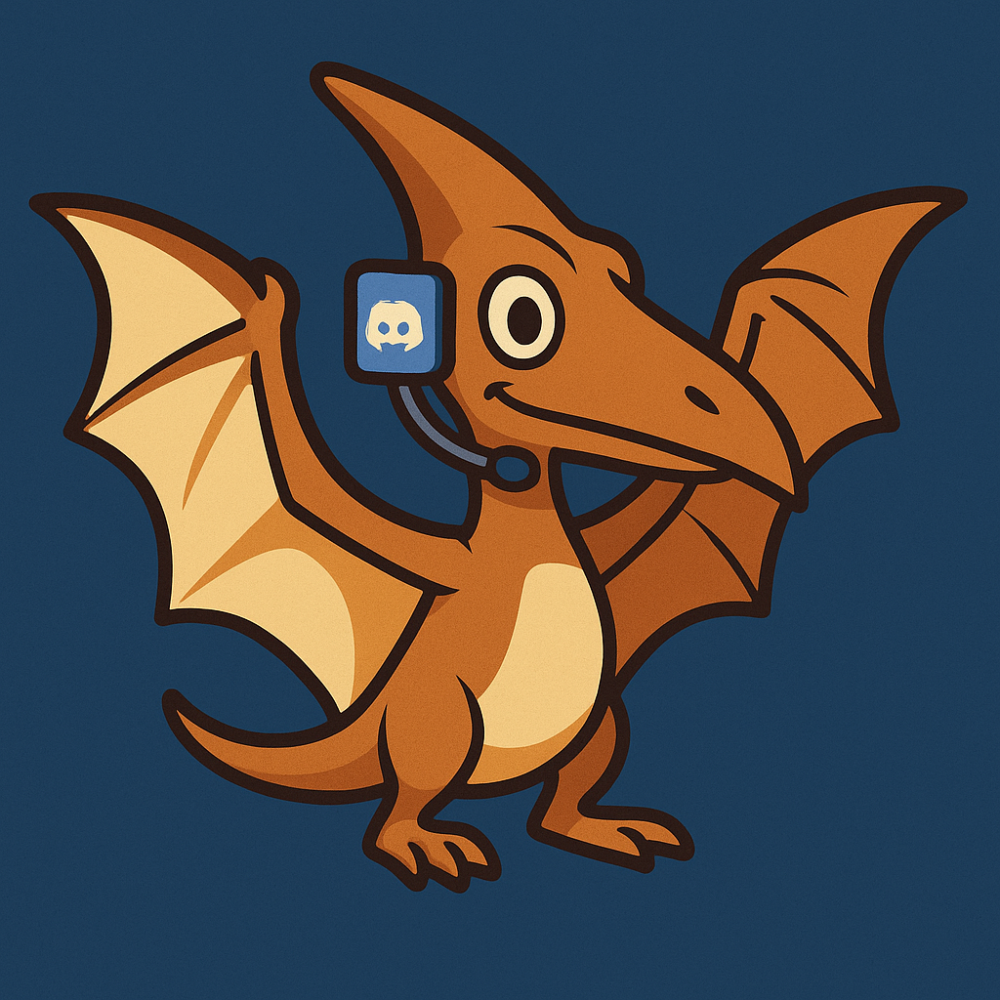

# PTBot - A Pterodactyl Server Discord bot🦖

Welcome to **PTBot** – your Discord-powered remote control for Pterodactyl game servers! 🚀



## What is PTBot?

PTBot is a Go-based Discord bot that lets you manage your Pterodactyl servers directly from Discord. Whether you want to start, stop, restart, check status, or send console commands, PTBot has you covered. It's like having a sysadmin in your pocket (or at least in your Discord sidebar).

## Features
- **Slash Commands**: Use `/pt` to list servers, check status, start, stop, restart, or send commands. 💬
- **Autocomplete**: Server names autocomplete for fast, typo-free ops. 🔍
- **Role & User Restrictions**: Only the cool kids (or the ones you allow) can use the bot. 😎
- **Health Checks**: PTBot keeps an eye on your Pterodactyl panel and sends alerts if things go sideways. ⚠️
- **Configurable**: Set up via config file or environment variables. Supports allowlists for guilds, roles, and users.

## Example Commands
- `/pt list` – See all your servers 📋
- `/pt status name:<server>` – Get server status 🩺
- `/pt start name:<server>` – Start a server ▶️
- `/pt stop name:<server>` – Stop a server ⏹️
- `/pt restart name:<server>` – Restart a server 🔄
- `/pt send name:<server> command:<cmd>` – Send a console command 💻

## Setup
1. **Build the bot** (see Dockerfile for details)
2. **Configure** your Discord token, Pterodactyl URL, and other secrets in `/data/config.json` or environment variables.
3. **Invite the bot** to your Discord server.
4. **Profit** (or at least enjoy easier server management).

## Docker & Docker Compose Setup

You can run PTBot easily using Docker or Docker Compose. This is the recommended way for production deployments.

### Docker Compose Example
```yaml
services:
  ptbot:
    image: ghcr.io/jacoknapp/ptbot:latest
    container_name: ptbot
    restart: unless-stopped
    volumes:
      - ./data:/data
    environment:
      DISCORD_TOKEN: <your-discord-bot-token>
      PTERO_BASE_URL: <your-pterodactyl-url>
      PTERO_CLIENT_TOKEN: <your-pterodactyl-client-api-token>
      ALERT_CHANNEL_ID: <discord-channel-id-for-alerts> #optional
      HEALTH_CHECK_INTERVAL: 2m #optional
      ALLOWED_GUILD_IDS: <comma-separated-guild-ids> #optional
      ALLOWED_ROLE_IDS: <comma-separated-role-ids> #optional
      ALLOWED_USER_IDS: <comma-separated-user-ids> #optional
      PTBOT_INSECURE: false #optional, set to true to allow untrusted TLS certs, env only
    command: ["-config", "/data/config.json"]
```

### Running
1. Copy the example above to `docker-compose.yml`.
2. Fill in your secrets and settings (optional if using config).
3. Run:
   ```sh
   docker compose up -d
   ```

### Docker (standalone)
You can also run PTBot directly with Docker:
```sh
docker run -d \
   -v $(pwd)/data:/data \
   -e DISCORD_TOKEN=... \
   -e PTERO_BASE_URL=... \
   -e PTERO_CLIENT_TOKEN=... \
   -e ALERT_CHANNEL_ID=... \
   -e HEALTH_CHECK_INTERVAL=2m \
   -e ALLOWED_GUILD_IDS=... \
   -e ALLOWED_ROLE_IDS=... \
   -e ALLOWED_USER_IDS=... \
   -e PTBOT_INSECURE=false \
  ghcr.io/jacoknapp/ptbot:latest -config /data/config.json
```

## Discord Bot Configuration

1. **Create a Discord Application**
   - Go to [Discord Developer Portal](https://discord.com/developers/applications)
   - Click "New Application" and give it a name
2. **Add a Bot User**
   - In your application, go to "Bot" and click "Add Bot"
   - Copy the bot token and set it as `DISCORD_TOKEN`
3. **Invite the Bot to Your Server**
   - Go to "OAuth2 > URL Generator"
   - Select "bot" and "applications.commands" scopes
   - Set permissions (at minimum: Send Messages, Use Slash Commands)
   - Copy the generated URL and open it in your browser to invite the bot
4. **Configure Allowed Guilds, Roles, Users** (optional)
   - Use the environment variables to restrict access

## How to Get a Pterodactyl Client API Key

To use PTBot, you'll need a Pterodactyl Client API key. Here's how to get one:

1. **Log in to your Pterodactyl panel** as the user who owns the servers you want to control.
2. Click your profile icon (top right) and select **"API"** from the dropdown menu.
3. Click **"New API Key"**.
4. Enter a name/description for the key (e.g., "PTBot") and set any desired IP restrictions.
5. Click **"Create"**.
6. Copy the generated API key and use it as the value for `PTERO_CLIENT_TOKEN` in your PTBot configuration.

> **Note:** Keep your API key secret! Anyone with this key can control your servers via PTBot.

## Contributing
PRs welcome! If you have a fun idea (or just want to add more emojis), fork away. 🦄

---

> "Why click buttons when you can `/pt start` like a boss?"

---

Made with ❤️, Go, and Discordgo.

---

## License

MIT License

Copyright (c) 2025 jacoknapp

Permission is hereby granted, free of charge, to any person obtaining a copy
of this software and associated documentation files (the "Software"), to deal
in the Software without restriction, including without limitation the rights
to use, copy, modify, merge, publish, distribute, sublicense, and/or sell
copies of the Software, and to permit persons to whom the Software is
furnished to do so, subject to the following conditions:

The above copyright notice and this permission notice shall be included in all
copies or substantial portions of the Software.

THE SOFTWARE IS PROVIDED "AS IS", WITHOUT WARRANTY OF ANY KIND, EXPRESS OR
IMPLIED, INCLUDING BUT NOT LIMITED TO THE WARRANTIES OF MERCHANTABILITY,
FITNESS FOR A PARTICULAR PURPOSE AND NONINFRINGEMENT. IN NO EVENT SHALL THE
AUTHORS OR COPYRIGHT HOLDERS BE LIABLE FOR ANY CLAIM, DAMAGES OR OTHER
LIABILITY, WHETHER IN AN ACTION OF CONTRACT, TORT OR OTHERWISE, ARISING FROM,
OUT OF OR IN CONNECTION WITH THE SOFTWARE OR THE USE OR OTHER DEALINGS IN THE
SOFTWARE.
